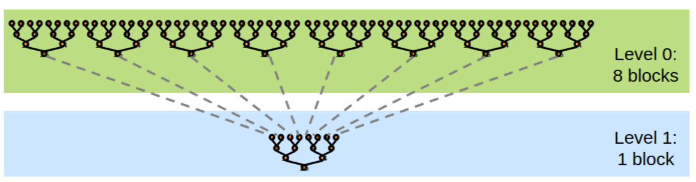

# 优化CUDA并行规约

From https://developer.download.nvidia.cn/assets/cuda/files/reduction.pdf

每个线程块中使用的基于树的方法
需要能够使用多个线程块
- 处理非常大的数组
- 使 GPU 上的所有多处理器保持繁忙状态
- 每个线程块都会减少数组的一部分

CUDA没有 Global Synchronization，所以采取分解到多个内核 Kernel Decomposition
内核启动充当全局同步点
内核启动的硬件开销可以忽略不计，软件开销低

递归内核调用 Recursive kernel invocation



选择接近 GPU 峰值性能的指标：
- GFLOP/s: for compute-bound kernels
- Bandwidth: for memory-bound kernels

1 flop per element loaded (bandwidth-optimal)

以 G80 GPU 为例：
384-bit memory interface, 900 MHz DDR  ->
`384 * 1800 / 8 = 86.4 GB/s` 

## Reduction1 Interleaved Addressing

交错寻址方式

```cpp
__global__ void reduce0(int *g_idata, int *g_odata) {
  extern __shared__ int sdata[];

  unsigned int tid = threadIdx.x;
  unsigned int i = blockIdx.x * blockDim.x + threadIdx.x;

  sdata[tid] = g_idata[i];
  __syncthreads();

  for (unsigned int s = 1; s < blockDim.x; s *= 2) {  // 步长每次翻倍
    if (tid % (2 * s) == 0) {   // tid  i -> threadIdx.x
    // 偶数的线程 += 偶数线程+1（奇数）
      sdata[tid] += sdata[tid + s];
    }
    __syncthreads();
  }

  if (tid == 0)
    g_odata[blockIdx.x] = sdata[0];
}
```


问题：高度发散的 warps 效率非常低，并且 % 算子非常慢 (每次都只用到了偶数的 thread)

## Reduction2 Interleaved Addressing

替换内循环中的发散分支，具有跨步索引和非发散分支

```cpp
__global__ void reduce0(int *g_idata, int *g_odata) {
  extern __shared__ int sdata[];

  unsigned int tid = threadIdx.x;
  unsigned int i = blockIdx.x * blockDim.x + threadIdx.x;

  sdata[tid] = g_idata[i];
  __syncthreads();

//--- change ---//
  for (unsigned int s = 1; s < blockDim.x; s *= 2) {
    int index = 2 * s * tid;
        // i -> index; 利用 index 偷换 i
        // 相当于每个 thread i 映射到一个 index
        // 利用 index 参与后续步骤
        // 但 index 仍全部为偶数 
    if (index < blockDim.x) {
      sdata[index] += sdata[index + s];
    }
    __syncthreads();
  }

  if (tid == 0)
    g_odata[blockIdx.x] = sdata[0];
}
```


新问题：共享内存库冲突

 
## Reduction3 Sequential Addressing

循序寻址

替换内部循环中的跨步索引，具有反向循环和基于 threadID 的索引

```cpp
__global__ void reduce0(int *g_idata, int *g_odata) {
  extern __shared__ int sdata[];

  unsigned int tid = threadIdx.x;
  unsigned int i = blockIdx.x * blockDim.x + threadIdx.x;

  sdata[tid] = g_idata[i];
  __syncthreads();

//--- change ---//
  for (unsigned int s = blockDim.x / 2; s > 0; s >> 1) {
    if (tid < s) {   // i tid -> threadIdx.x
      sdata[tid] += sdata[tid + s];
    }
    __syncthreads();
  }

  if (tid == 0)
    g_odata[blockIdx.x] = sdata[0];
}
```


顺序寻址是无冲突的


## Reduction4 First Add During Load

```cpp
// Problem:
for(unsigned int s = blockDim.x/2; s > 0; s >>= 1){
    if(tid < s){
        sdata[tid] += sdata[tid + s];
    }
    __syncthreads();
}
```

一半的线程在第一次循环迭代时处于空闲状态！
这太浪费了......

在首次加载过程中ADD

将 blocks 减半，并替换单个 load：

```cpp
#include <thread>
__global__ void reduce0(int *g_idata, int *g_odata) {
  extern __shared__ int sdata[];

  unsigned int tid = threadIdx.x;
  // unsigned int i = blockIdx.x * blockDim.x + threadIdx.x;
  //  sdata[tid] = g_idata[i];
  //  with two loads and first add of the reduction
  //  perform first level of reduction
  unsigned int i = blockIdx.x * blockDim.x * 2 + threadIdx.x;
  // blocks 数可以减半！！
  sdata[tid] = g_idata[i] + g_idata[i + blockDim.x];

  __syncthreads();

  for (unsigned int s = blockDim.x / 2; s > 0; s >> 1) {
    if (tid < s) {
      sdata[tid] += sdata[tid + s];
    }
    __syncthreads();
  }

  if (tid == 0)
    g_odata[blockIdx.x] = sdata[0];
}
```

## Reduction5 Unroll the Last Warp

上述结果远低于带宽限制，因为 reduction 的算术强度很低

因此，一个可能的瓶颈是指令开销 

Ancillary instructions 不是负载、存储或算术的核心计算指令 （Ancillary instructions that are not loads, stores, or
arithmetic for the core computation）

换言之：是寻址算术和循环开销 （In other words: address arithmetic and loop overhead）

策略： 循环展开 （unroll loops）

Unrolling the Last Warp
- 随着缩减的进行，# “活动”线程减少；当 s <= 32 时，我们只剩下一个 warp
- 指令在一个 warp 内是 SIMD 同步的
- 这意味着当 s <= 32 时： 不需要 `__syncthreads()`; 不需要不起作用的 `if(tid < s)` 
- 展开内部循环的最后 6 次迭代

```c++
// 一个 warp（32） 是 SIMD sync， 所以不需要加显示同步
__device__ void warpReduce(volatile int *sdata, int tid) {   
  sdata[tid] += sdata[tid + 32];    // 相当于 SIMD, 一个 warp 内所有的都会执行这一步
  sdata[tid] += sdata[tid + 16];
  sdata[tid] += sdata[tid + 8];
  sdata[tid] += sdata[tid + 4];
  sdata[tid] += sdata[tid + 2];
  sdata[tid] += sdata[tid + 1];
}

__global__ void reduce0(int *g_idata, int *g_odata) {
  extern __shared__ int sdata[];

  unsigned int tid = threadIdx.x;
  // unsigned int i = blockIdx.x * blockDim.x + threadIdx.x;

  //  sdata[tid] = g_idata[i];
  //  with two loads and first add of the reduction
  //  perform first level of reduction
  unsigned int i = blockIdx.x * blockDim.x * 2 + threadIdx.x;
  sdata[tid] = g_idata[i] + g_idata[i + blockDim.x];

  __syncthreads();

  for (unsigned int s = blockDim.x / 2; s > 32; s >> 1) {
    if (tid < s) {
      sdata[tid] += sdata[tid + s];
    }
    __syncthreads();
  }

  if (tid < 32)
    warpReduce(sdata, tid);

  //  if(tid < 32){
  //      volatile int *smem = sdata;
  //      #pragma unroll 8
  //      for(unsigned innt s=16; s>=1; s>>=1){
  //          smem[tid] += smem[tid+s];
  //      }
  //  }

  if (tid == 0)
    g_odata[blockIdx.x] = sdata[0];
}
```

重要： 为了使正确性，必须使用“volatile”关键字！

注意：这节省了所有 warp 的无用工作，而不仅仅是最后一个！

在不展开的情况下，所有 warp 都会执行 for 循环和 if 状态的每次迭代


## Reduction6 Completely Unrolled

在 G80 GPU 中， block 的大小被限制到 512 threads， 一般都是采用 2 的幂次方的 size

所以可以轻松地展开固定块的大小

利用模板 Templates

将块的大小指定为函数的模板参数

```cpp

__device__ void warpReduce(volatile int *sdata, int tid) {
  if (blockSize >= 64)
    sdata[tid] += sdata[tid + 32];
  if (blockSize >= 32)
    sdata[tid] += sdata[tid + 16];
  if (blockSize >= 16)
    sdata[tid] += sdata[tid + 8];
  if (blockSize >= 8)
    sdata[tid] += sdata[tid + 4];
  if (blockSize >= 4)
    sdata[tid] += sdata[tid + 2];
  if (blockSize >= 2)
    sdata[tid] += sdata[tid + 1];
}

template<unsigned int blockSize>
__global__ void reduce(int *g_idata, int *g_odata) {
  extern __shared__ int sdata[];

  unsigned int tid = threadIdx.x;
  unsigned int i = blockIdx.x * blockDim.x * 2 + threadIdx.x;
  sdata[tid] = g_idata[i] + g_idata[i + blockDim.x];

  __syncthreads();

  if(blockSize >= 512){
    if(tid < 256){
      sdata[tid] += sdata[tid+256];
      __syncthreads();
    }
  }

  if(blockSize >= 256){
    if(tid < 128){
      sdata[tid] += sdata[tid+128];
      __syncthreads();
    }
  }

  if(blockSize >= 128){
    if(tid < 64){
      sdata[tid] += sdata[tid+64];
      __syncthreads();
    }
  }

  if (tid < 32)
    warpReduce(sdata, tid);

  if (tid == 0)
    g_odata[blockIdx.x] = sdata[0];
}

```

## Parallel Reduction Complexity

布伦特定理 Brent's theorem 建议 O(N/log N) 个 threads

每个线程执行 O(log N) 顺序工作

然后所有 O(N/log N) 线程协作执行 O(log N) 步骤

成本 = O((N/log N) * log N) = O(N)  成本效率高

有时称为算法级联 algorithm cascading，可以在实践中带来显着的加速

结合顺序和并行 reduction

每个线程将多个元素加载并求和到共享内存

布伦特定理 - 每个线程应该对 O(log n) 个元素求和

i.e. 1024 or 2048 elements per block vs. 256

每个线程可以完成更多工作，从而可能更好地隐藏延迟

每个块更多的线程减少了递归树中的级别内核调用

当只有少量块时，在最后几个级别上存在较高的内核启动开销。

```cpp

__device__ void warpReduce(volatile int *sdata, int tid) {
  if (blockSize >= 64)
    sdata[tid] += sdata[tid + 32];
  if (blockSize >= 32)
    sdata[tid] += sdata[tid + 16];
  if (blockSize >= 16)
    sdata[tid] += sdata[tid + 8];
  if (blockSize >= 8)
    sdata[tid] += sdata[tid + 4];
  if (blockSize >= 4)
    sdata[tid] += sdata[tid + 2];
  if (blockSize >= 2)
    sdata[tid] += sdata[tid + 1];
}

template<unsigned int blockSize>
__global__ void reduce(int *g_idata, int *g_odata) {
  extern __shared__ int sdata[];
  unsigned int tid = threadIdx.x;
  unsigned int i = blockIdx.x * blockSize * 2 + threadIdx.x;
  unsigned int gridSize = blockSize * 2 * gridDim.x;
  // 注意：gridSize循环步幅以保持合并！

  sdata[tid] = 0;

  while(i < n){
    sdata[tid] += g_idata[i] + g_idata[i+blockSize];
    i += gridSize;
  }
  __syncthreads();

  if(blockSize >= 512){
    if(tid < 256){
      sdata[tid] += sdata[tid+256];
      __syncthreads();
    }
  }

  if(blockSize >= 256){
    if(tid < 128){
      sdata[tid] += sdata[tid+128];
      __syncthreads();
    }
  }

  if(blockSize >= 128){
    if(tid < 64){
      sdata[tid] += sdata[tid+64];
      __syncthreads();
    }
  }

  if (tid < 32)
    warpReduce(sdata, tid);

  if (tid == 0)
    g_odata[blockIdx.x] = sdata[0];
}
```

