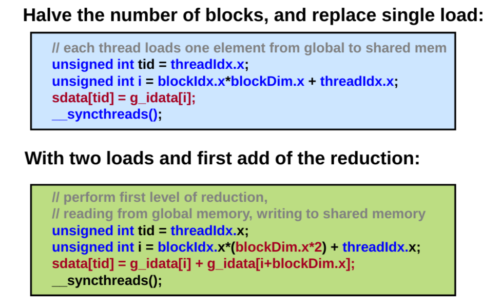
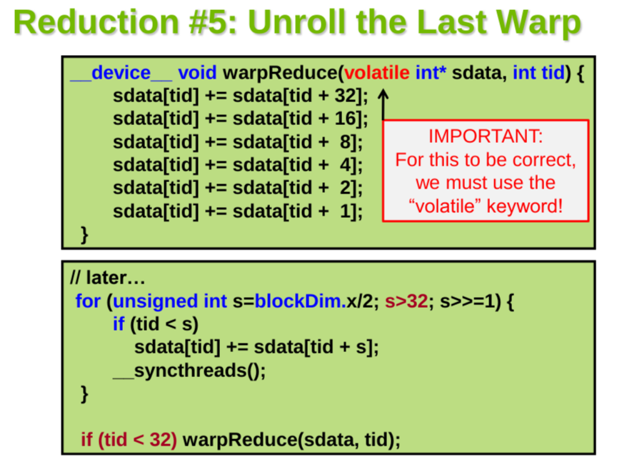
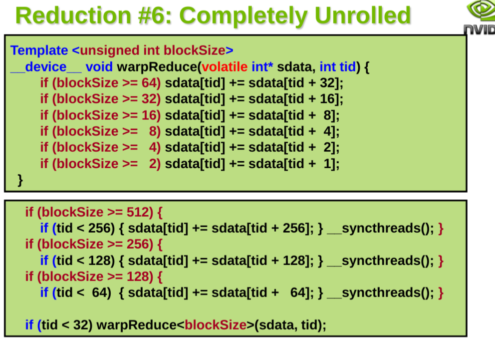
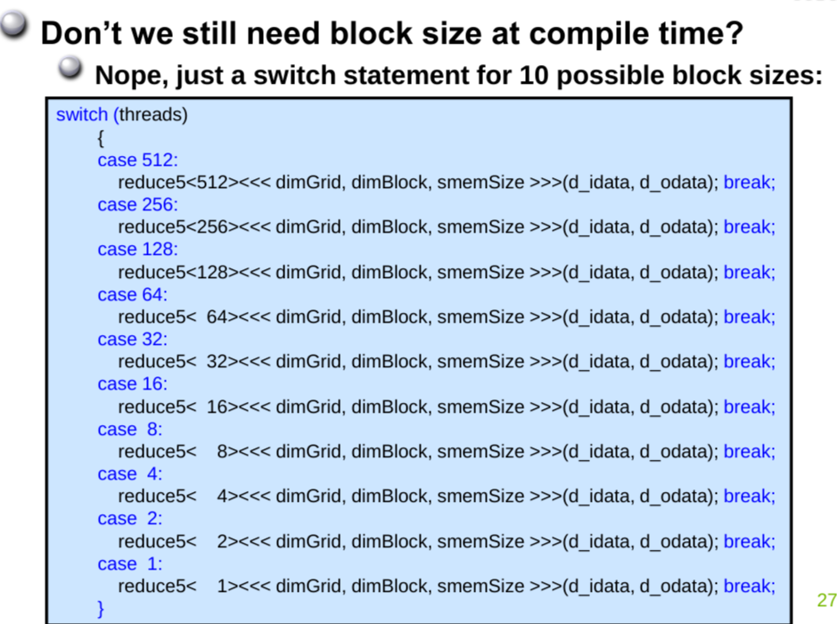

```cpp
#include <stdio.h>
#include <cuda_runtime.h>

__global__ void reduce0(int *g_idata, int *g_odata) {
  extern __shared__ int sdata[];

  unsigned int tid = threadIdx.x;
  unsigned int i = blockIdx.x * blockDim.x + threadIdx.x;

  sdata[tid] = g_idata[i];
  //__syncthreads();  // 移除第一次规约的同步

  for (unsigned int s = blockDim.x / 2; s > 0; s >>= 1) {
    if (tid < s) {
      sdata[tid] += sdata[tid + s];
    }
    __syncthreads();
  }

  if (tid == 0)
    g_odata[blockIdx.x] = sdata[0];
}

int main() {
  const int N = 1024;  // 数组大小
  const int block_size = 256;  // 每个块的线程数量

  // 在主机端分配和初始化输入数组
  int h_idata[N];
  for (int i = 0; i < N; ++i) {
    h_idata[i] = i;
  }

  // 在设备端分配和初始化输入和输出数组
  int *d_idata, *d_odata;
  cudaMalloc((void**)&d_idata, N * sizeof(int));
  cudaMalloc((void**)&d_odata, (N / block_size) * sizeof(int));
  cudaMemcpy(d_idata, h_idata, N * sizeof(int), cudaMemcpyHostToDevice);

  // 第一次规约
  reduce0<<<N / block_size, block_size, block_size * sizeof(int)>>>(d_idata, d_odata);

  // 同步设备
  cudaDeviceSynchronize();

  // 第二次规约（将输入和输出数组都设置为d_odata）
  reduce0<<<1, N / block_size, (N / block_size) * sizeof(int)>>>(d_odata, d_odata);

  // 同步设备
  cudaDeviceSynchronize();

  // 在设备端将结果传输回主机端
  int h_odata;
  cudaMemcpy(&h_odata, d_odata, sizeof(int), cudaMemcpyDeviceToHost);

  // 打印结果
  printf("Final reduction result: %d\n", h_odata);

  // 释放设备端内存
  cudaFree(d_idata);
  cudaFree(d_odata);

  return 0;
}
```








```cpp
__device__ void warpReduce(volatile int *sdata, int tid) {
  if (blockSize >= 64)
    sdata[tid] += sdata[tid + 32];
  if (blockSize >= 32)
    sdata[tid] += sdata[tid + 16];
  if (blockSize >= 16)
    sdata[tid] += sdata[tid + 8];
  if (blockSize >= 8)
    sdata[tid] += sdata[tid + 4];
  if (blockSize >= 4)
    sdata[tid] += sdata[tid + 2];
  if (blockSize >= 2)
    sdata[tid] += sdata[tid + 1];
}

template<unsigned int blockSize>
__global__ void reduce(int *g_idata, int *g_odata) {
  extern __shared__ int sdata[];
  unsigned int tid = threadIdx.x;
  // unsigned int i = blockIdx.x * blockDim.x + threadIdx.x;

  //  sdata[tid] = g_idata[i];
  //  with two loads and first add of the reduction
  //  perform first level of reduction
  unsigned int i = blockIdx.x * blockSize * 2 + threadIdx.x;
  unsigned int gridSize = blockSize * 2 * gridDim.x;

  sdata[tid] = 0;

  while(i < n){
    sdata[tid] += g_idata[i] + g_idata[i+blockSize];
    i += gridSize;
  }
  __syncthreads();

  if(blockSize >= 512){
    if(tid < 256){
      sdata[tid] += sdata[tid+256];
      __syncthreads();
    }
  }

  if(blockSize >= 256){
    if(tid < 128){
      sdata[tid] += sdata[tid+128];
      __syncthreads();
    }
  }

  if(blockSize >= 128){
    if(tid < 64){
      sdata[tid] += sdata[tid+64];
      __syncthreads();
    }
  }

  if (tid < 32)
    warpReduce(sdata, tid);
  //  if(tid < 32){
  //      volatile int *smem = sdata;
  //      #pragma unroll 8
  //      for(unsigned innt s=16; s>=1; s>>=1){
  //          smem[tid] += smem[tid+s];
  //      }
  //  }

  if (tid == 0)
    g_odata[blockIdx.x] = sdata[0];
}
```

```cpp

// 两遍规约
template<unsigned int numThreads>
__global__ void reduction1_kernel(int *out, const int *in, size_t N)
{
    // lenght = threads (BlockDim.x)
    extern __shared__ int sPartials[];
    int sum = 0;
    const int tid = threadIdx.x;
    for (size_t i = blockIdx.x * numThreads+ tid; i < N; i += numThreads * gridDim.x)
    {
        sum += in[i];
    }
    sPartials[tid] = sum;
    __syncthreads();

    if (numThreads >= 1024)
    {
        if (tid < 512) sPartials[tid] += sPartials[tid + 512];
        __syncthreads();
    }
    if (numThreads >= 512)
    {
        if (tid < 256) sPartials[tid] += sPartials[tid + 256];
        __syncthreads();
    }
    if (numThreads >= 256)
    {
        if (tid < 128) sPartials[tid] += sPartials[tid + 128];
        __syncthreads();
    }
    if (numThreads >= 128)
    {
        if (tid < 64) sPartials[tid] += sPartials[tid + 64];
        __syncthreads();
    }

    if (tid < 32)
    {
        volatile int *wsSum = sPartials;
        if (numThreads >= 64) wsSum[tid] += wsSum[tid + 32];
        if (numThreads >= 32) wsSum[tid] += wsSum[tid + 16];
        if (numThreads >= 16) wsSum[tid] += wsSum[tid + 8];
        if (numThreads >= 8) wsSum[tid] += wsSum[tid + 4];
        if (numThreads >= 4) wsSum[tid] += wsSum[tid + 2];
        if (numThreads >= 2) wsSum[tid] += wsSum[tid + 1];

        if (tid == 0)
        {
            out[blockIdx.x] = wsSum[0];
        }
    }
}

```

```cpp
template<unsigned int numThreads>
void reduction1_template(int *answer, int *partial, const int *in, const size_t N, const int numBlocks)
{
    unsigned int sharedSize = numThreads * sizeof(int);

    // kernel execution
    reduction1_kernel<numThreads><<<numBlocks, numThreads, sharedSize>>>(partial, in, N);
    reduction1_kernel<numThreads><<<1, numThreads, sharedSize>>>(answer, partial, numBlocks);
}

void reduction1t(int *answer, int *partial, const int *in, const size_t N, const int numBlocks, int numThreads)
{
    switch (numThreads)
    {
        case 1: reduction1_template<1>(answer, partial, in, N, numBlocks); break;
        case 2: reduction1_template<2>(answer, partial, in, N, numBlocks); break;
        case 4: reduction1_template<4>(answer, partial, in, N, numBlocks); break;
        case 8: reduction1_template<8>(answer, partial, in, N, numBlocks); break;
        case 16: reduction1_template<16>(answer, partial, in, N, numBlocks); break;
        case 32: reduction1_template<32>(answer, partial, in, N, numBlocks); break;
        case 64: reduction1_template<64>(answer, partial, in, N, numBlocks); break;
        case 128: reduction1_template<128>(answer, partial, in, N, numBlocks); break;
        case 256: reduction1_template<256>(answer, partial, in, N, numBlocks); break;
        case 512: reduction1_template<512>(answer, partial, in, N, numBlocks); break;
        case 1024: reduction1_template<1024>(answer, partial, in, N, numBlocks); break;
    }
}

```


```cpp

 // lenght = threads (BlockDim.x)
    extern __shared__ int sPartials[];
    int sum = 0;
    const int tid = threadIdx.x;
    for (size_t i = blockIdx.x * blockDim.x + tid; i < N; i += blockDim.x * gridDim.x)
    {
        sum += in[i];
    }
    sPartials[tid] = sum;
    __syncthreads();

    // 调整为2^n
    unsigned int floowPow2 = blockDim.x;
    if (floowPow2 & (floowPow2 - 1))
    {
        while(floowPow2 & (floowPow2 - 1))
        {
            floowPow2 &= (floowPow2 - 1);
        }
        if (tid >= floowPow2)
        {
            sPartials[tid - floowPow2] += sPartials[tid];
        }
        __syncthreads();
    }

```


```cpp
// 矩阵乘法
vector<vector<int>> matrixMultiply(const vector<vector<int>>& A, const vector<vector<int>>& B) {
    int m = A.size();
    int n = B[0].size();
    int p = A[0].size();

    vector<vector<int>> C(m, vector<int>(n, 0));

    for (int i = 0; i < m; i++) {
        for (int j = 0; j < n; j++) {
            for (int k = 0; k < p; k++) {
                C[i][j] += A[i][k] * B[k][j];
            }
        }
    }

    return C;
}

```

```cpp
// 分块矩阵乘法
vector<vector<int>> matrixMultiplyBlocked(const vector<vector<int>>& A, const vector<vector<int>>& B, int block_size) {
    int m = A.size();
    int n = B[0].size();
    int p = A[0].size();

    vector<vector<int>> C(m, vector<int>(n, 0));

    for (int i = 0; i < m; i += block_size) {
        for (int j = 0; j < n; j += block_size) {
            for (int k = 0; k < p; k += block_size) {
                // 计算当前块的结果
                for (int ii = i; ii < min(i + block_size, m); ii++) {
                    for (int jj = j; jj < min(j + block_size, n); jj++) {
                        for (int kk = k; kk < min(k + block_size, p); kk++) {
                            C[ii][jj] += A[ii][kk] * B[kk][jj];
                        }
                    }
                }
            }
        }
    }

    return C;
}

```

```cpp

ListNode* reverseList(ListNode* head) {
    ListNode* prev = nullptr;
    ListNode* curr = head;
    while (curr != nullptr) {
        ListNode* next = curr->next;
        curr->next = prev;
        prev = curr;
        curr = next;
    }
    return prev;
}

```


```cpp
void quickSort(vector<int>& nums, int left, int right) {
    if (left >= right) return;
    
    int pivot = partition(nums, left, right);
    quickSort(nums, left, pivot - 1);
    quickSort(nums, pivot + 1, right);
}

int partition(vector<int>& nums, int left, int right) {
    int pivot = nums[right];
    int i = left;
    for (int j = left; j < right; j++) {
        if (nums[j] < pivot) {
            swap(nums[i], nums[j]);
            i++;
        }
    }
    swap(nums[i], nums[right]);
    return i;
}

```

```cpp
void merge(vector<int>& nums, int left, int mid, int right) {
    vector<int> temp(right - left + 1);
    int i = left, j = mid + 1, k = 0;
    while (i <= mid && j <= right) {
        if (nums[i] <= nums[j]) {
            temp[k++] = nums[i++];
        } else {
            temp[k++] = nums[j++];
        }
    }
    while (i <= mid) {
        temp[k++] = nums[i++];
    }
    while (j <= right) {
        temp[k++] = nums[j++];
    }
    for (int i = left; i <= right; i++) {
        nums[i] = temp[i - left];
    }
}

void mergeSort(vector<int>& nums, int left, int right) {
    if (left >= right) return;
    int mid = left + (right - left) / 2;
    mergeSort(nums, left, mid);
    mergeSort(nums, mid + 1, right);
    merge(nums, left, mid, right);
}

```


```cpp
struct TreeNode {
    int val;
    TreeNode *left;
    TreeNode *right;
    TreeNode() : val(0), left(nullptr), right(nullptr) {}
    TreeNode(int x) : val(x), left(nullptr), right(nullptr) {}
    TreeNode(int x, TreeNode *left, TreeNode *right) : val(x), left(left), right(right) {}
};

void preorderTraversal(TreeNode* root) {
    if (!root) return;
    cout << root->val << " ";
    preorderTraversal(root->left);
    preorderTraversal(root->right);
}
```


```cpp
#include <iostream>
#include <queue>

int main() {
    std::queue<int> q;

    // 入队
    q.push(1);
    q.push(2);
    q.push(3);

    // 打印队列
    std::cout << "Queue: ";
    while (!q.empty()) {
        std::cout << q.front() << " ";
        q.pop();
    }
    std::cout << std::endl;

    // 再次入队
    q.push(4);
    q.push(5);

    // 访问队头元素
    std::cout << "Front element: " << q.front() << std::endl;

    // 出队
    q.pop();
    std::cout << "After pop, front element: " << q.front() << std::endl;

    return 0;
}

```

```cpp
#include <iostream>
#include <stack>

int main() {
    std::stack<int> s;

    // 压栈
    s.push(1);
    s.push(2);
    s.push(3);

    // 打印栈
    std::cout << "Stack: ";
    while (!s.empty()) {
        std::cout << s.top() << " ";
        s.pop();
    }
    std::cout << std::endl;

    // 再次压栈
    s.push(4);
    s.push(5);

    // 访问栈顶元素
    std::cout << "Top element: " << s.top() << std::endl;

    // 出栈
    s.pop();
    std::cout << "After pop, top element: " << s.top() << std::endl;

    return 0;
}

```


